# ponssight

Локальный дашборд-зеркало лаунчпада [ponsfamily.com](https://www.ponsfamily.com/launchpad)
на Robinhood Chain (chain id 4663). Читает чейн напрямую по JSON-RPC: лента
запусков, объёмы, кто снайпит запуски и сколько на этом зарабатывает,
копирование чужого запуска и запуск своего.

## Демо

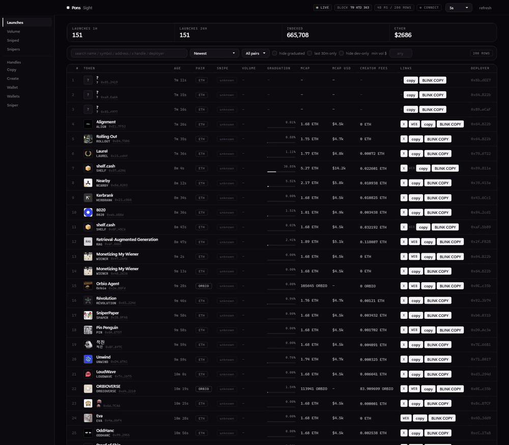

То же самое видеофайлом, 19 секунд: [docs/demo.mp4](docs/demo.mp4). GitHub
проигрывает mp4 из репозитория только по прямой ссылке, поэтому анимированный
обзор выше - GIF.

**Кадры сняты на копии рабочей базы.** В них настоящая лента настоящего чейна:
665 тысяч запусков, логотипы, объёмы, счётчики, которые считает индексер. Ни
одного придуманного числа в кадре нет, и ни одного своего ключа тоже: на
вкладке Wallets стоит демонстрационный сейф, кошелёк на вкладке Wallet выбран
из публичных адресов вкладки Snipers, а вотчлист владельца в кадр не попал.
Что именно заменено и почему - в разделе [Данные в кадрах](#данные-в-кадрах).

## Содержание

- [Что это](#что-это)
- [Запуск](#запуск)
- [Вкладки](#вкладки)
- [Архитектура](#архитектура)
- [Фоновые циклы](#фоновые-циклы)
- [Глубина индекса](#глубина-индекса)
- [Настройки](#настройки)
- [Данные в кадрах](#данные-в-кадрах)
- [Синтетическая база](#синтетическая-база)
- [Тесты](#тесты)
- [Скриншоты вкладок](#скриншоты-вкладок)
- [API](#api)
- [Структура](#структура)
- [Лицензия](#лицензия)

## Что это

Оригинальный лаунчпад тормозит: новый токен появляется в его ленте с заметной
задержкой, а список обновляется редко. Этот дашборд показывает то же самое, но

- читает данные напрямую из чейна по JSON-RPC, а не парсит страницу сайта;
- работает локально: FastAPI + SQLite + один статический HTML, ни сборщика,
  ни фреймворка на фронтенде;
- новый запуск попадает в таблицу примерно через секунду после блока
  (websocket-подписка на `TokenLaunched`), а опрос через `eth_getLogs` идёт
  следом как страховка от пропусков;
- страница обновляется сама, раз в пять секунд; переключается в шапке.

Сверх ленты запусков здесь есть четыре ответа, которых у лаунчпада нет:
объём торгов по каждому токену, заснайпили токен или нет, сколько на снайпах
заработал каждый кошелёк, и копирование чужого запуска в один клик.

## Запуск

Нужен Python 3.10+.

```
pip install -r requirements.txt
python server.py
```

Затем открыть http://127.0.0.1:8787

Первый запуск пустой: база `data/pons.db` создаётся на месте, и фоновые циклы
начинают обход чейна сами. Лента заполняется сверху вниз, история подтягивается
назад, поэтому через минуту на странице уже есть запуски за последний час, а
полная глубина набирается в фоне. Глубину задаёт `PONS_INDEX_WINDOW`, по
умолчанию 30 дней.

Публичная нода чейна работает без ключа, но жёстко ограничивает `eth_call`, так
что полный бэкфилл на ней идёт медленно. Своя нода ставится в `PONS_RPC_URL`,
полный список настроек - в разделе [Настройки](#настройки).

## Вкладки

Десять вкладок и карточка монеты поверх любой из них. Роут у каждой свой,
`#<вкладка>`, аргумент через слэш, карточка - `#<вкладка>/coin/<адрес>`, так
что любой экран дашборда это ссылка, которую можно переслать себе.

| Вкладка | Что показывает |
| --- | --- |
| **Launches** | Живая лента запусков: возраст, пара, метка снайпа, объём, прогресс до градации, mcap, ссылки, деплоер. |
| **Volume** | Рейтинг по объёму торгов за окно `5m` / `1h` / `6h` / `24h` / `all`. |
| **Sniped** | Сами монеты, которые заснайпили. По умолчанию `labels=sniped,bundled`: чужие снайпы плюс атомарные покупки самого деплоера. |
| **Snipers** | Кошельки, которые первыми заходили в запуски, с раскрытием списка их монет и профита по каждой. |
| **Handles** | Поиск по твиттер-хендлу: запускался ли под ним токен и сколько, с вердиктом по числу деплоеров. Сюда же вводится юзернейм, чтобы получить профиль X и список подписок. |
| **Copy** | Форма запуска-копии, заранее заполненная всеми параметрами выбранного токена. |
| **Create** | Та же форма, но пустая: логотип на IPFS и поля самого запуска. |
| **Wallet** | Подключение кошелька (`window.ethereum`) и сводка по адресу: его запуски, ранние покупки, вотчлист. |
| **Wallets** | Приватные ключи кошельков в сейфе, их балансы в Robinhood и Arbitrum, их запуски, и перенос всего ETH через relay.link. |
| **Sniper** | Профиль одного снайпера: полоса метрик, критерии захода и таблица всех его покупок. |

Карточка монеты открывается кликом по строке: график цены и объёма, холдеры,
вердикт по снайпу и то, сколько заработал или потерял первый покупатель.

## Архитектура

| Файл | Что делает |
| --- | --- |
| `config.py` | Все константы чейна и настройки. Читает переменные окружения `PONS_*`, создаёт `data/` и `data/cache`. Больше нигде константы не хардкодятся. |
| `chain.py` | Доступ к чейну: `eth_getLogs` с адаптивным диапазоном, Multicall3 (`aggregate3`), декодирование метаданных токена и состояния кривой. Единый гейт `RpcGate`. |
| `store.py` | SQLite (WAL): схема, upsert запусков и сделок, выборки для API, математика кривой, `prune()`. |
| `indexer.py` | Фоновые циклы: индексация запусков, таймстемпы, обогащение, обновление, курсы, чистка. |
| `trades.py` | Второй индексатор: проходит по логам `CurveBuy` / `CurveSell`, считает объёмы и время сделок, копит ранние покупки, ведёт счётчик кошельков-снайперов. |
| `snipe.py` | Чистая функция вердикта «заснайпили или нет». Ничего не читает и не пишет: на вход строки, на выход метка и score. Поэтому проверяется тестами без запущенного сервера. |
| `handles.py` | Чистая нормализация поля `twitter` в хендл: снимает схему, хост и путь, знает зарезервированные пути (`x.com/i`, `x.com/search`) и отсекает прозу. Тот же модуль считает вердикт «чей это запуск» по числу деплоеров. |
| `xprofile.py` | Чистый разбор аккаунта X из двух форматов, в которых он приезжает: новый GraphQL и старый REST 1.1 из списков. Обе функции отдают одну плоскую форму, без сети и базы. |
| `xsource.py` | Сторона X: один профиль и постраничный обход подписок. Клиент импортируется из соседнего бота по `PONS_XCLIENT_DIR`, а не копируется. Токен не логируется никогда, только имя переменной. |
| `fees.py` | Сколько токен выплатил кошельку, который его запустил. Отдельный проход по логам `FeesSwept`. |
| `keysafe.py` | Сейф: шифрование ключей парольной фразой (Web3 keystore v3) и её состояние в памяти процесса. Фраза не пишется на диск и не читается из окружения. |
| `bridge.py` | Переносы через relay.link: котировка, арифметика «отправить все», подпись одной ноги ключом с этой машины. |
| `imgcache.py` | Дисковый кэш картинок и обход шлюзов, который его наполняет. |
| `repair.py` | Ручной проход по уже пройденным блокам: возвращает первые покупки, которые обход потерял. Без `--dry-run` пишет, с ним откатывает. |
| `server.py` | FastAPI: JSON API, раздача `static/index.html`, кэширующий прокси картинок `/img`. |
| `static/` | Дашборд целиком: `index.html`, `css/`, `js/` по модулю на вкладку. Vanilla JS, без сборки. |

Модули, которые отвечают на вопросы, держат ответ в чистой функции
(`snipe.py`, `handles.py`, `xprofile.py`): на вход строки и числа, на выход
вердикт. Поэтому логика вердиктов проверяется тестами без базы, без сети и без
браузера, а `server.py` остаётся тонким.

## Фоновые циклы

Список `LOOPS` в `indexer.py`, каждый цикл - отдельный daemon-поток:

| Цикл | Что делает |
| --- | --- |
| `ws` | `eth_subscribe` на логи `TokenLaunched`: новый запуск пишется в базу сразу. При обрыве переподключается. Выключается через `PONS_WSS_ENABLED=0`. |
| `backfill` | Разовый обход истории на старте: сравнивает самый старый запуск в базе с полом из `_history_floor` и добирает разницу назад шагами по `PONS_HISTORY_CHUNK`. |
| `tail` | Опрос через `eth_getLogs`. Дальше каждые `PONS_POLL_SECONDS` добирает новые блоки, не больше `PONS_TAIL_CATCHUP` за тик. Страховка к `ws`, чтобы не было дыр. |
| `trades` | История сделок: идёт назад от тип-блока окнами по `PONS_TRADES_SPAN` блоков и параллельно добирает живой хвост. Лог, чья кривая ещё не проиндексирована, ждёт в буфере: иначе первые покупки свежего токена терялись бы навсегда. |
| `candles` | Разовый проход для таблиц карточки монеты (`price_points`, `wallet_trades`), помечен в `kv` ключом `candles_done`. |
| `fees` | Сколько каждый токен отдал кошельку, который его запустил, по логам `FeesSwept`. Курсор монотонный: это накопительная сумма. |
| `timestamp` | Добирает `launch_ts` и `launch_tx` для токенов без них. |
| `enrich` | Для токенов с `meta_ok=0` читает name/symbol/description/logo/socials и состояние кривой батчами multicall по `PONS_BATCH` токенов за проход. |
| `refresh` | Держит данные свежими: голова из `PONS_REFRESH_HEAD` самых новых обновляется каждый тик, остальная таблица прокручивается ротацией. |
| `price` | Курсы: ETH/USD с Coinbase, стоковые quote-активы с Yahoo, стейблкоины = 1.0. После обновления курса `mcap_usd` пересчитывается. |
| `prune` | Чистит ведра объёмов и покупателей старше `PONS_TRADE_KEEP_HOURS`. Запуски не удаляет. |
| `logos` | Наполняет кэш картинок заранее, по одной с паузой: это единственное место, которое тратит чужой канал. Когда кэш прогрет, цикл не делает ничего. |
| `cache` | Выбрасывает из кэша картинок то, что старше `PONS_IMAGE_TTL_HOURS`. Отдельный цикл, а не ветка чистки запусков: тот про индекс и выключен по умолчанию, этот про папку и включён всегда. |

## Глубина индекса

Запуски индексируются назад до **блока деплоя фабрики** (по умолчанию
`26841846`), и это глубина, а не срок хранения: что попало в базу, остаётся там.

Разница видна на числах. Цепочка Robinhood молодая, фабрика задеплоена
3 августа 2026, и окно в 30 дней останавливало обход на 31 дне из 43, которые
лаунчпад к тому моменту прожил. Из-за этого «нет запуска под этим хендлом» на
вкладке Handles означало «нет за месяц», читаясь при этом как «нет никогда».

## Настройки

Всё через переменные окружения с префиксом `PONS_`. Часть, к которой придётся
возвращаться чаще остальных:

| Переменная | По умолчанию | Что делает |
| --- | --- | --- |
| `PONS_HOST` / `PONS_PORT` | `127.0.0.1` / `8787` | Где слушает сервер. |
| `PONS_RPC_URL` | публичная нода чейна | Своя нода. Публичная работает без ключа, но медленно на бэкфилле. |
| `PONS_WSS` / `PONS_WSS_ENABLED` | публичный ws / `1` | Живая подписка на `TokenLaunched`. |
| `PONS_INDEX` | `1` | `0` полностью выключает индексер: дашборд читает базу как она есть, ничего не запускается и ни один запрос к RPC не уходит. |
| `PONS_INDEX_WINDOW` | 30 дней в блоках | Как далеко назад идёт обход. |
| `PONS_FACTORY_DEPLOY` | `26841846` | Пол глубины: ниже блока деплоя фабрики запусков быть не может. |
| `PONS_POLL_SECONDS` | `4.0` | Период опроса чейна. |
| `PONS_TRADE_BUCKET` / `PONS_TRADE_KEEP_HOURS` | `300` / `25.0` | Ведра объёмов и сколько они живут. |
| `PONS_SNIPE_BLOCKS` / `PONS_EARLY_BLOCKS` | `2` / `10` | Пороги вердикта «заснайпили». |
| `PONS_BOT_HITS` | `5` | Сколько заходов делают кошелёк ботом по версии вкладки Snipers. |
| `PONS_WAL_MAX_GIB` | `4.0` | Потолок журнала WAL: при его достижении журнал сворачивается принудительно. |
| `PONS_XCLIENT_DIR` | пусто | Папка соседнего бота, откуда берётся клиент X. Без неё вкладка Handles ищет по хендлам, но профиль и подписки отдают 503. Токен читается из окружения или из `.env`, образец с именами переменных - [`.env.example`](.env.example). |
| `PONS_LOGO_PREFETCH` / `PONS_LOGO_PAUSE` | см. `config.py` | Сколько логотипов прогревать заранее и с какой паузой. |

Полный список - в `config.py`: он там весь, с комментарием у каждой группы.

## Данные в кадрах

GIF, mp4 и одиннадцать скриншотов сняты против копии боевой базы: 665 708
запусков, 665 705 из них с метаданными, 9 981 прошедший градацию, вершина
индекса на блоке 79 472 343. Сервер для съёмки поднят с `PONS_INDEX=0`:
индексер на время съёмки остановлен, иначе счётчики в шапке и футере уезжают
между первым кадром и последним, а GIF, в котором футер спорит сам с собой,
читается как подделка.

Заменены в кадрах ровно две вещи, и обе про личное:

- **сейф** (вкладка Wallets). Список на этой вкладке рисуется из базы
  независимо от того, заперт сейф или нет, поэтому в кадр попали бы адреса и
  подписи боевых ключей владельца. В копии базы на их месте стоят два
  демонстрационных, помеченных `0x7000...` - той же меткой, которой помечено
  всё выдуманное у `tools/seed_demo.py`;
- **кошелёк** (вкладка Wallet) взят из публичных адресов: это верхний кошелёк
  вкладки Snipers, он и так виден кадром выше. Своего вотчлиста в кадрах нет,
  он у владельца пуст.

Ни ключей, ни парольных фраз, ни личных списков в `docs/` не попадает.

Съёмка - две команды, обе в репозитории:

```
bash tools/demo_shots.sh     # docs/shots/*.png, одиннадцать вкладок
bash tools/demo_media.sh     # docs/demo.gif и docs/demo.mp4 из тех же кадров
```

`demo_shots.sh` сам разбирается, против чего работает. Больше трёхсот токенов
или непустой `latest_block` - значит перед ним боевой индекс, и тогда адреса,
которые нельзя записать заранее, он спрашивает у API: какой токен открыть
(первый на доске объёмов, у которого есть история цены), какой кошелёк
показать, какое окно объёма выставить. Меньше - значит демо-база, и там все
адреса детерминированные. Флаг для этого не нужен: кадр с пустой таблицей
неотличим от кадра со сломанной вкладкой, и один раз уже случилось ровно это.

## Синтетическая база

`tools/seed_demo.py` строит синтетическую базу - 48 токенов, из них 6 прошли
градацию, у каждого своя кривая, сделки, ведра объёмов и точки цены; 18
кошельков-снайперов; четыре кошелька в вотчлисте, три из них запускали токены;
два ключа в сейфе под парольной фразой, которая тут же и напечатана. Адреса
синтетические и помечены: `0x7000...` токены, `0xc0de...` кривые, `0xdead...`
деплоеры, `0xbeef...` покупатели, `0xcafe...` кошельки вотчлиста.

```
python tools/seed_demo.py --force      # пересоздать data/pons.db
PONS_INDEX=0 python server.py          # поднять сервер с выключенным индексером
```

Нужна она тестам и CI, где ни чейна, ни сети быть не должно, и она же - способ
посмотреть дашборд, не поднимая индекс на полтора миллиона блоков. Кадры в
`docs/` с неё не сняты: снимок выдуманной ленты показывает вёрстку, а не
проект.

Скрипт детерминированный, поэтому съёмка на нём повторяема до последней цифры:
`demo_shots.sh` в этом режиме не спрашивает у API ничего, кроме верхнего
кошелька на вкладке Snipers.

## Тесты

```
bash tools/run_tests.sh          # все
bash tools/run_tests.sh snipe    # один файл
```

Восемь файлов, ни сети, ни запущенного сервера. Каждый файл - самостоятельный
скрипт: гоняет кейсы сверху вниз, печатает строку на кейс и выходит ненулевым
кодом на первой записанной ошибке. Поэтому `pytest tests/` их не собирает и
падает на `sys.exit` в конце первого файла, и запускать их надо раннером выше.
Базы dashboard'а тесты не трогают: те, которым нужна база, уводят `C.DB_PATH` в
временную папку до первого соединения.

Если в окружении сломан сторонний pytest-плагин (`web3.tools` ломается на
`web3` седьмой версии), `pytest` падает ещё до сбора тестов;
`PYTEST_DISABLE_PLUGIN_AUTOLOAD=1 pytest` это обходит. На `tools/run_tests.sh`
это не влияет: он вызывает файлы напрямую.

Один кейс в `tests/test_xprofile.py` пропускается, если на машине нет соседнего
бота X (`PONS_XCLIENT_DIR`): он проверяет чужой парсер, который в этот
репозиторий не входит.

Гейт собирает всё вместе:

```
python tools/gate.py
```

Маркап против эталона, покрытие классов стилями, разбор всех JS и Python
модулей, проверка что каждый читаемый глобал и атрибут модуля существует, запрет
цветовых литералов вне `tokens.css`, запрет длинных тире, ASCII в CSS, живая
проверка страницы и эндпоинтов, и тесты. Один запуск, один вердикт.

Тот же гейт гоняется и в CI на каждый push
(`.github/workflows/ci.yml`): он собирает демо-базу, поднимает дашборд с
`PONS_INDEX=0` и запускает `tools/gate.py`. Именно против демо-базы, а не против
пустой: живая часть гейта спрашивает сервер про настоящие строки, а пустая база
отвечает на все эти вопросы пустой таблицей и кодом 200, то есть проверка
прошла бы, ничего не проверив.

## Скриншоты вкладок

Все одиннадцать - из того же прогона, что и GIF, на той же базе.

<table>
<tr>
<td width="50%">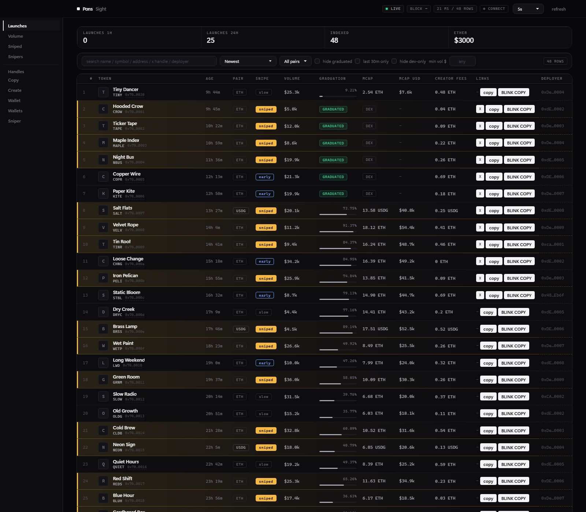<br>
<sub><b>Launches.</b> Лента запусков: возраст, пара, метка снайпа, объём,
прогресс до градации, mcap, деплоер.</sub></td>
<td width="50%">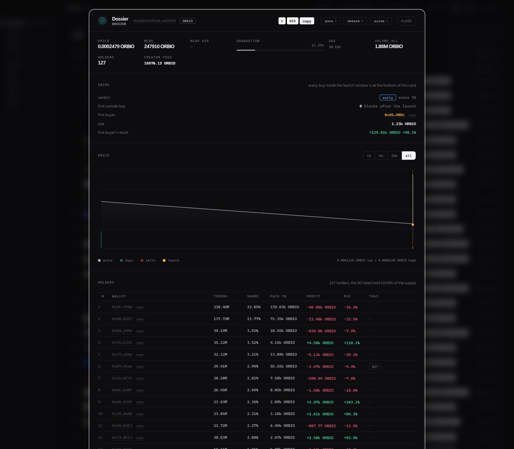<br>
<sub><b>Карточка монеты.</b> График цены и объёма, холдеры, вердикт по снайпу,
профит первого покупателя.</sub></td>
</tr>
<tr>
<td>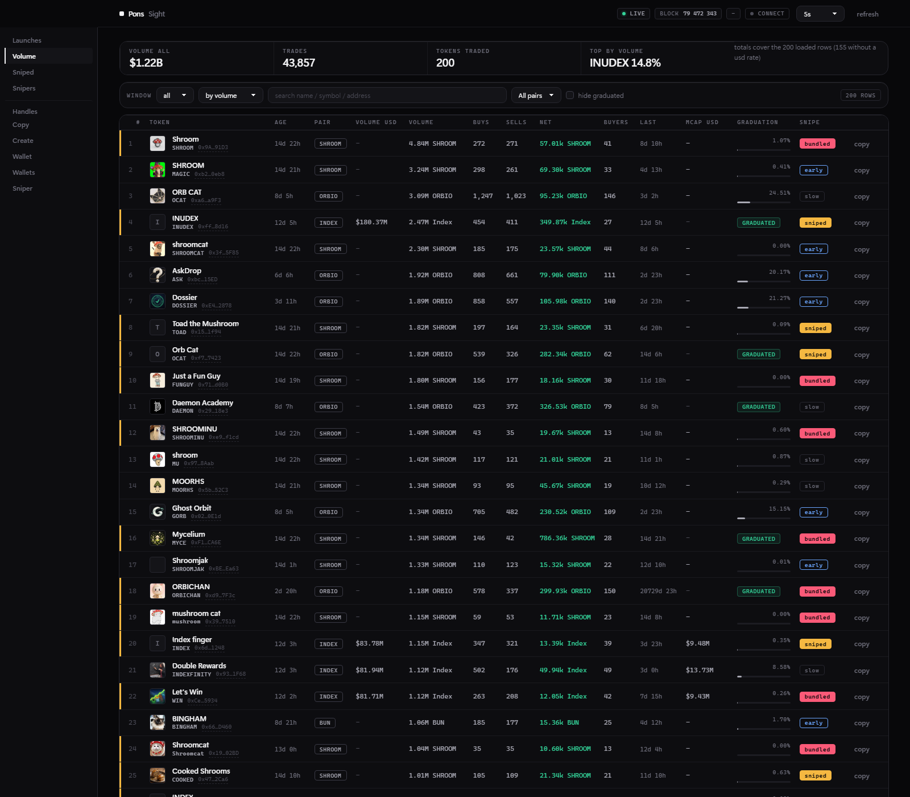<br>
<sub><b>Volume.</b> Рейтинг по объёму за окно, с сортировкой по любой колонке.</sub></td>
<td>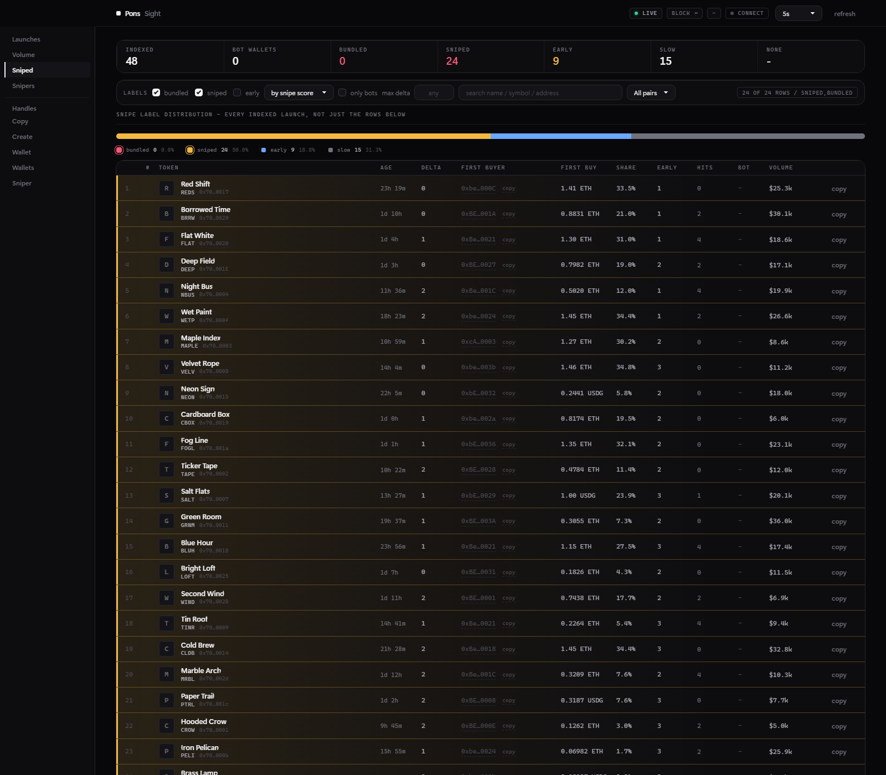<br>
<sub><b>Sniped.</b> Монеты, которые заснайпили: чужие снайпы и атомарные
покупки самого деплоера.</sub></td>
</tr>
<tr>
<td>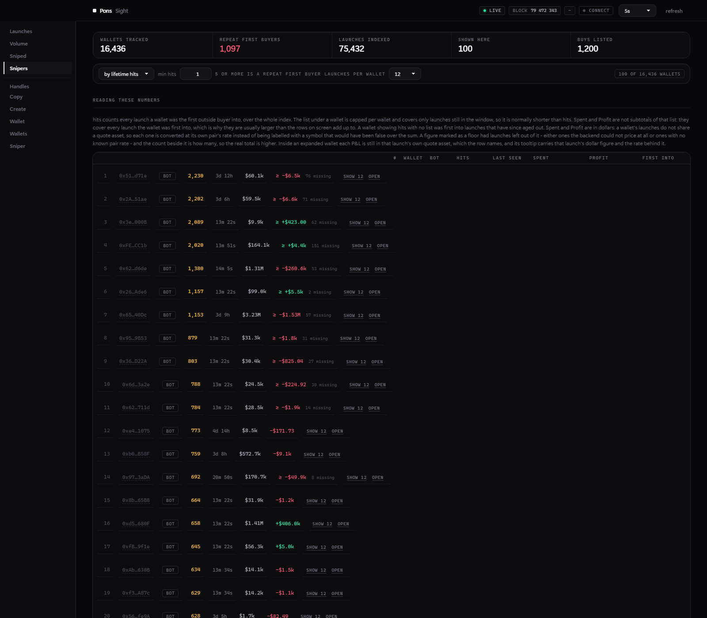<br>
<sub><b>Snipers.</b> Кошельки, которые заходили первыми, со списком их монет и
профитом по каждой.</sub></td>
<td>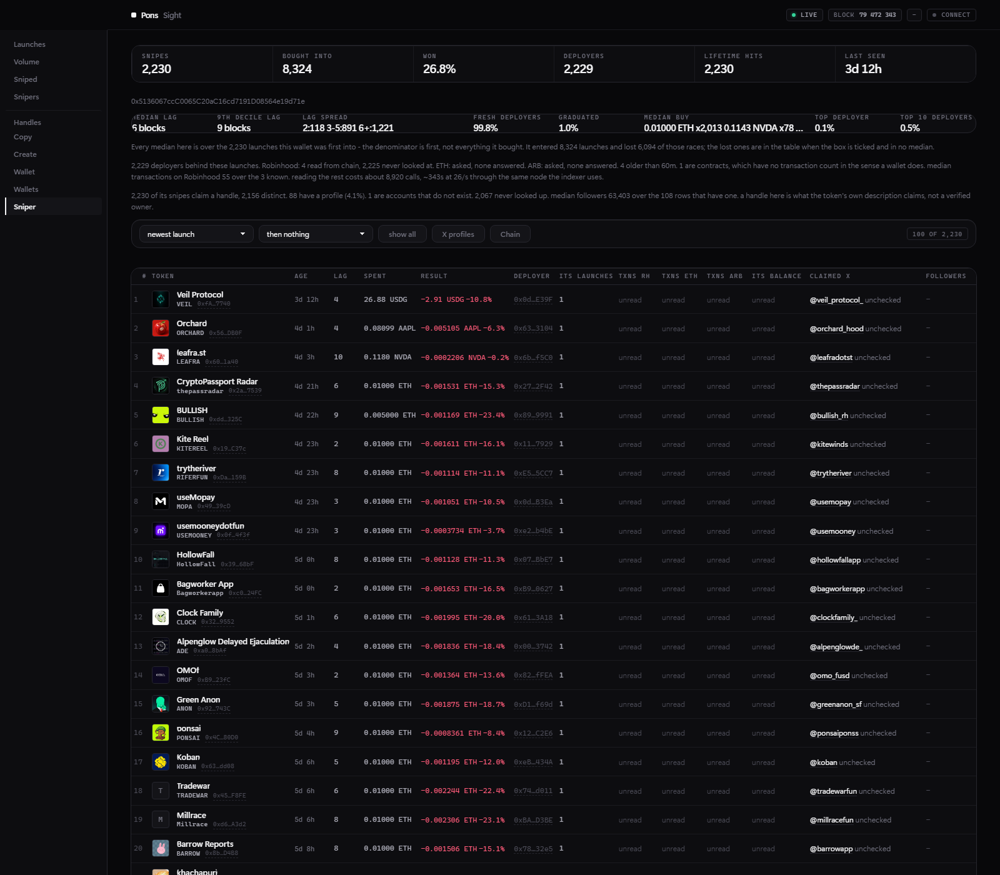<br>
<sub><b>Sniper.</b> Профиль одного кошелька: метрики, критерии захода и таблица
всех его покупок.</sub></td>
</tr>
<tr>
<td>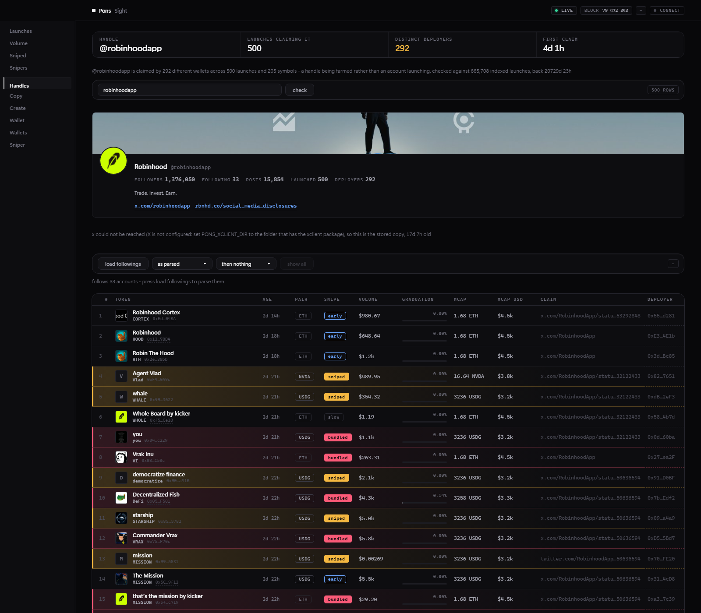<br>
<sub><b>Handles.</b> Запрос по хендлу: сколько запусков под ним и вердикт по
числу деплоеров.</sub></td>
<td>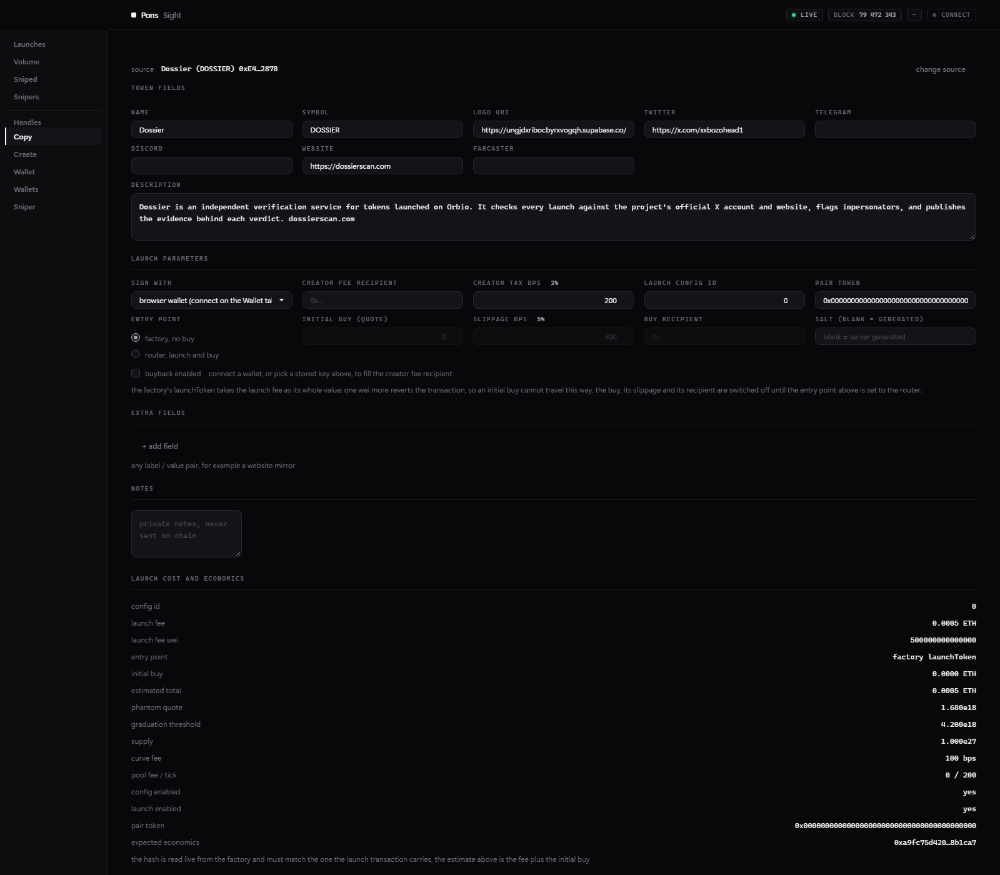<br>
<sub><b>Copy.</b> Форма запуска-копии и стоимость запуска, прочитанная из
фабрики.</sub></td>
</tr>
<tr>
<td>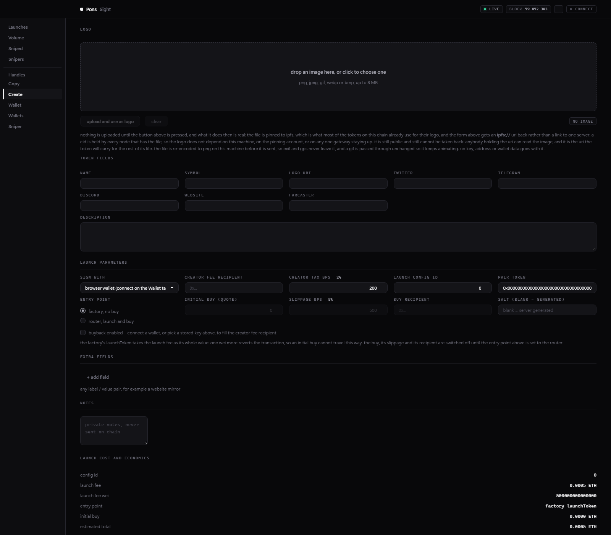<br>
<sub><b>Create.</b> Та же форма пустой: логотип на IPFS и поля своего
запуска.</sub></td>
<td>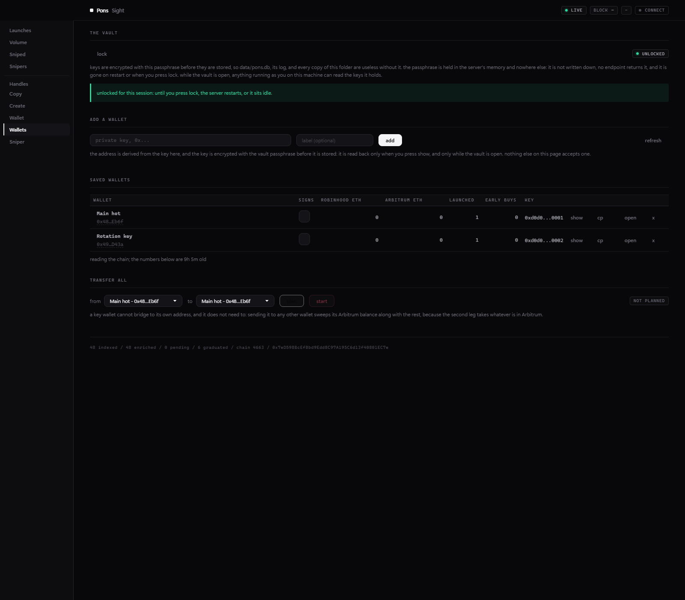<br>
<sub><b>Wallets.</b> Сейф: два ключа, их балансы в двух сетях, их запуски и
перенос всего ETH.</sub></td>
</tr>
<tr>
<td>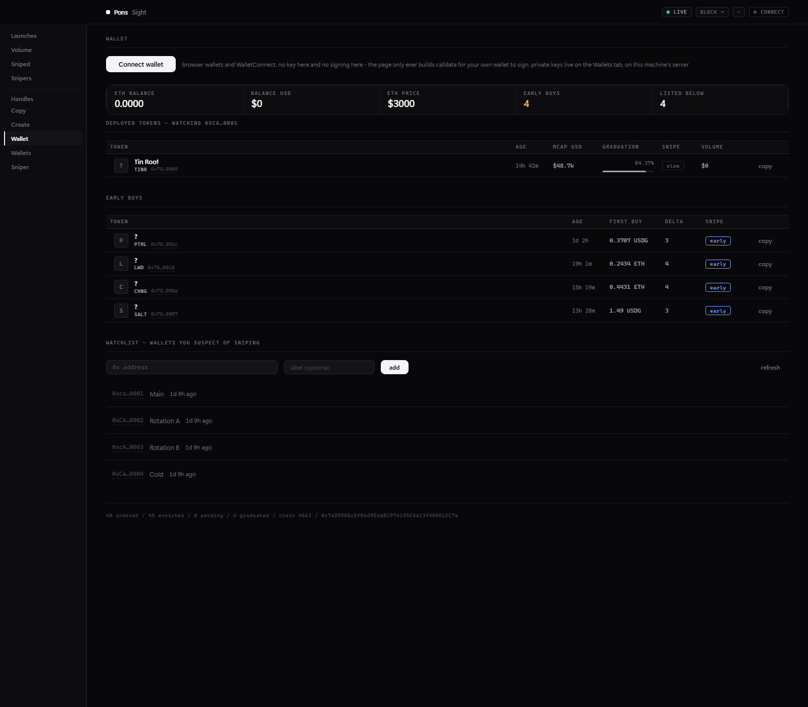<br>
<sub><b>Wallet.</b> Сводка по одному адресу: баланс, ранние покупки, ни одного
своего запуска.</sub></td>
<td></td>
</tr>
</table>

## API

Каждая вкладка - это один эндпоинт. Полное описание запросов, параметров и
формы ответов: [docs/API.md](docs/API.md). Контракт интерфейса, пороги
раскладки и палитра: [docs/DESIGN.md](docs/DESIGN.md).

## Структура

```
.
├── server.py            FastAPI: API, страница, прокси картинок
├── indexer.py           фоновые циклы обхода чейна
├── chain.py             RPC, multicall, декодирование
├── store.py             схема SQLite и все выборки
├── trades.py  snipe.py  fees.py        сделки, вердикт снайпа, выплаты
├── handles.py xprofile.py xsource.py   твиттер-хендл и сторона X
├── keysafe.py bridge.py                сейф и переносы через relay.link
├── imgcache.py repair.py               кэш логотипов, ручной ремонт
├── config.py            все настройки и константы чейна
├── static/              index.html, css/, js/ по модулю на вкладку
├── tests/               восемь самостоятельных тест-файлов
├── tools/
│   ├── gate.py          один запуск всех проверок
│   ├── run_tests.sh     раннер тестов
│   ├── seed_demo.py     синтетическая база
│   ├── demo_shots.sh    съёмка вкладок
│   ├── demo_media.sh    GIF и mp4 из кадров
│   ├── shot.js          съёмка через DevTools protocol
│   ├── contract/        эталон маркапа и инвентарь классов
│   └── *.py             проверки: маркап, CSS, имена
├── docs/                API.md, DESIGN.md, demo.gif, demo.mp4, shots/
├── .github/workflows/   CI: демо-база, дашборд, gate
├── .env.example         образец для X-сессии
└── data/                база, кэш картинок, логи (в git не попадает)
```

## Лицензия

MIT, см. [LICENSE](LICENSE).
